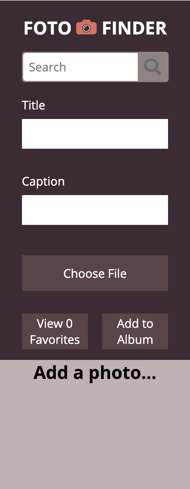
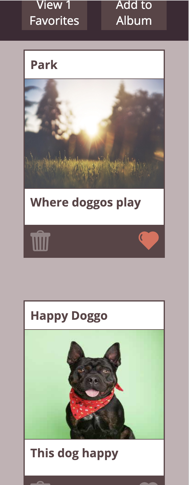

# Foto-Finder-Redo

- With Foto-Finder we used Javascript to make the page functional
- Used eppoch time to set ID's to new instances of foto cards
- User can save favorited photos
- User can change text on foto cards
- localStorage allows user to save changes to cards being edited by user
- Used array prototypes to iterate through declared array
- Used CSS tools such as: Grid and Flex
- Page is repsonsive down to 320 pixels

## My-Project

## Responsiveness

